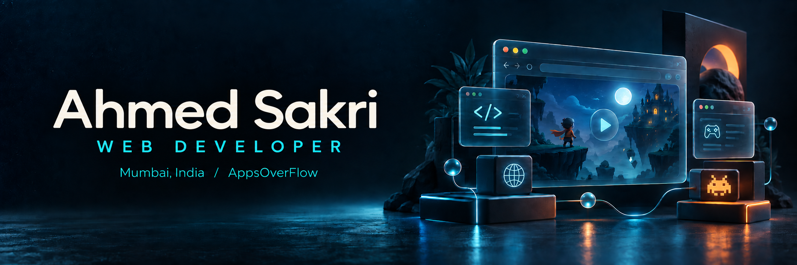
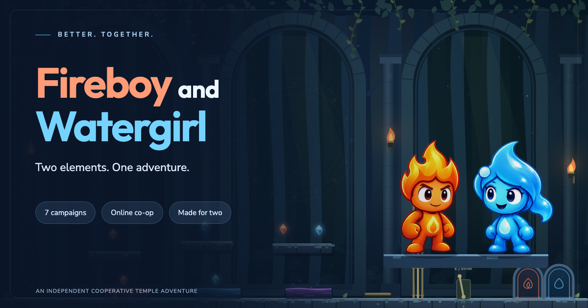

  <b>Web applications. Cooperative games. Thoughtful details.</b> 
  I build interactive experiences and keep improving how they look, feel, and perform.

  
  
  

## A little about me

I'm **Ahmed**, a web developer based in **Mumbai, India**. My current product work is under **AppsOverFlow**, spanning responsive interfaces, APIs, and browser games.

I care about clear navigation, comfortable controls, reliable performance, and the engineering behind them. I enjoy turning user feedback into improvements people can actually feel.

## Featured project · Fireboy and Watergirl

**Two players. Seven campaigns. One shared adventure.**

An independent cooperative puzzle game with same-device play and online multiplayer. My current work includes touch joysticks, multiplayer responsiveness, room mechanisms, verified walkthroughs, liquid effects, audio, loading performance, SEO, and privacy choices.

The game is actively being improved; some rooms are still in development.

  

## My toolkit

**Interfaces**

  
  
  
  

**APIs & data**

  
  
  
  

**Design & delivery**

  
  
  
  

<b>More technologies I work with</b>

HTML, CSS, Sass, Quasar, Vuetify, Redux, Gatsby, REST APIs, AWS, Jenkins, Mocha, Playwright, and Postman.

## Explore my public work

| Project | What it explores |
| :--- | :--- |
| **[oidc-vue](https://github.com/ahmedsakri/oidc-vue)** | OpenID Connect authentication for Vue and Vue Router. |
| **[crud-swagger](https://github.com/ahmedsakri/crud-swagger)** | A CRUD API with Swagger documentation. |
| **[aspire-checkout](https://github.com/ahmedsakri/aspire-checkout)** | A checkout interface built with Vue. |
| **[css-battle-solutions](https://github.com/ahmedsakri/css-battle-solutions)** | CSS drawing challenges with minimal HTML. |
| **[jupiter](https://github.com/ahmedsakri/jupiter)** | A JavaScript visual experiment inspired by Jupiter. |
| **[Netflix-Clone](https://github.com/ahmedsakri/Netflix-Clone)** | A static HTML/CSS website recreation. |

---

  <b>Thanks for stopping by.</b> 
  <a href="https://ahmedsakri.netlify.app/">Portfolio</a> ·
  <a href="https://github.com/ahmedsakri?tab=repositories">Projects</a> ·
  <a href="https://app.daily.dev/ahmedsakri">What I'm reading</a>

